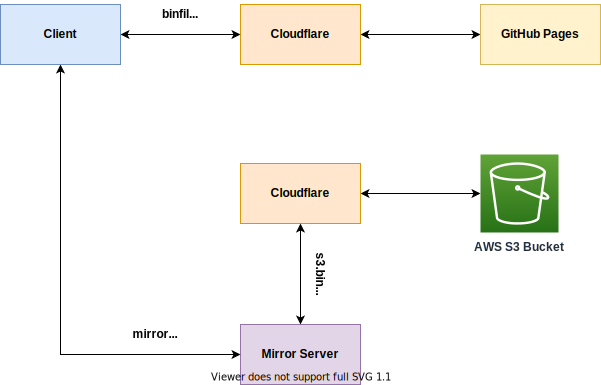

# binfiles.net

## Overview

## Public Website

This repo contains all public binfiles.net website data in `/docs`.  The website is hosted on GitHub Pages; requests to `binfiles.net` and `www.binfiles.net` are cached through CloudFlare's CDN.  Both IPv4 and IPv6 access is supported; HTTPS is required.

## Data Files and Hash Files

This repo contains two type of files in `/mirror`:  data files and file hashes.

The data files are created using random binary data in standard sizes that are distributed to binfiles.net mirrors around the world.  Users can request these files from mirrors to test their download speeds across various paths.

Data files follow binary byte sizes.  For example, 1MB = 1,048,576 Bytes or 500MB = 524,288,000 Bytes.

These are the sizes currently supported on binfiles.net mirrors:

| Size | Bytes |
| ---: | ---: |
| `1MB` | 1048576 |
| `10MB` | 10485760 |
| `100MB` | 104857600 |
| `500MB` | 524288000 |
| `1000MB` | 1048576000 |

Hashes of data files are provided as an option for verifying the integrity of downloads.  Hash files are hosted on all mirrors.  Hash types currently provided include `SHA256`, `SHA1`, and `MD5`.

Users can compare the hash from the mirror to the hash determined locally after download to ensure a complete, correct download occurred.  This helps the user check not only bandwidth but also connection integrity.

### Hosting

Data Files and Hash Files are stored on AWS S3 and accessible via s3.binfiles.net; requests to `s3.binfiles.net` are cached through CloudFlare's CDN.  Both IPv4 and IPv6 access is supported; HTTPS is required.

Please note that `s3.binfiles.net` should only be used for mirror operators to download and sync/update standard mirror data and not as a resource for end users to perform network download tests.  Since requests are cached through CloudFlare, there will be unpredictable results compared to downloads initiated using local/regional binfiles.net mirrors.

## Setup a new mirror server

1. Ensure FTP and/or HTTP (not HTTPS) services are active on the mirror server

1. Ensure that `python3` and `pip` are installed on the mirror server

1. Create a new publicly accessible folder where the mirror files will be saved, such as //yourdomain.com/mirror/

1. Download the installer from https://s3.binfiles.net/mirror-setup.py

1. Run the `mirror-setup.py` script to download the mirror files

1. Create a cron job to run the `mirror-sync.py` script (12-hour intervals recommended)

## Ensure all files on a mirror server are the latest versions

1. Login to the mirror server and navigate to the publicly accessible folder here mirror files are saved

1. Run `mirror-sync.py` to download:
   * All new data files and hash files not present on the mirror
   * Any files on the mirror whose local hash files are missing
   * Any files on the mirror whose hash files do not match the hash files on s3.binfiles.net
   * Any files whose locally computed hash does not match their previously downloaded hash files

1. Please note that `mirror-sync.py` will delete all files not needed by the mirror in the current folder -- if hosting on a server with other non-mirror content, the binfiles.net mirror data should be stored in a separate folder, such as //yourdomain.com/mirror/

## Update the mirror-sync routine to the latest version

1. Run `mirror-update.py` which will download and replace the `mirror-sync.py` file with the current version hosted at `s2.binfiles.net`